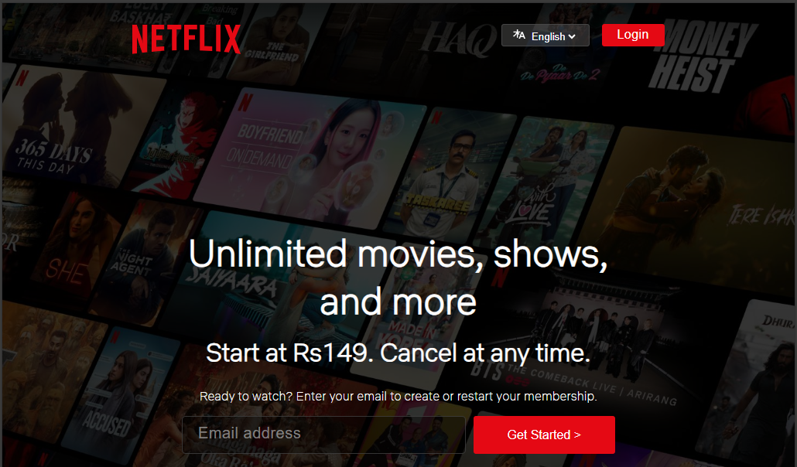
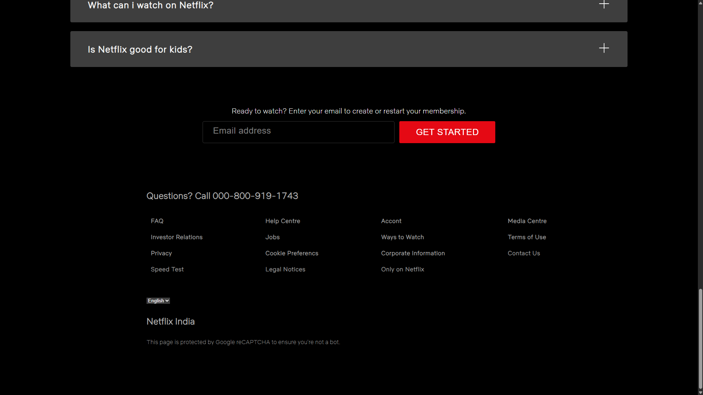
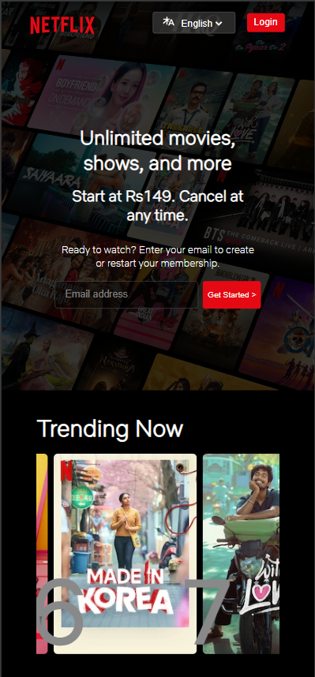
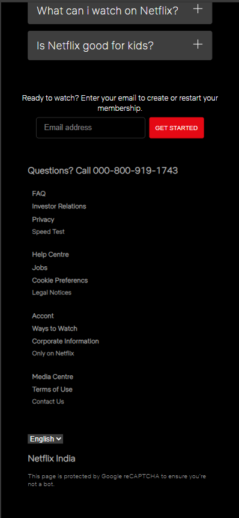

# Netflix Landing Page Clone

A fully responsive Netflix landing page built using HTML and CSS to demonstrate real-world UI and responsive design skills.

## Preview

## Live Demo

🔗 https://your-live-link.vercel.app

## Tech Stack

- HTML5
- CSS3 (Flexbox, Grid, Media Queries)

## Features

- Fully responsive design (mobile, tablet, desktop)
- Pixel-perfect layout inspired by Netflix
- Clean and structured UI
- Reusable CSS classes

## Learnings

- Building responsive layouts using media queries
- Handling complex UI sections and alignment
- Importance of spacing and visual hierarchy
- Real-world UI implementation vs tutorial-based designs

## Getting Started

1. Clone the repo
2. Open index.html in your browser

## Acknowledgement

Design inspired by Netflix.